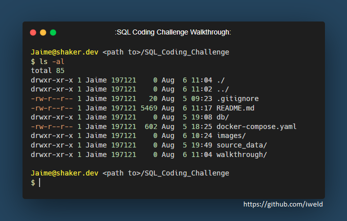
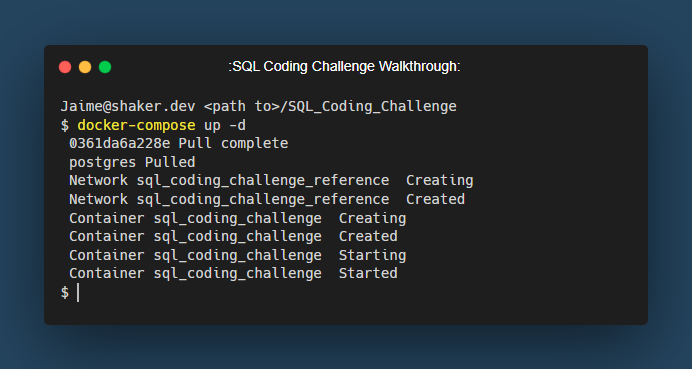

## Basic/Intermediate SQL Code Challenge

**Author**: Jaime M. Shaker  
**Email**: jaime.m.shaker@gmail.com  
**Website**: https://www.shaker.dev  
**LinkedIn**: https://www.linkedin.com/in/jaime-shaker/   

:exclamation: If you find this repository helpful, please consider giving it a :star:. Thanks! :exclamation:

### Set Up

This repository contains all of the necessary files, data and directories for running a PostgresSQL server in a Docker Container.  The only prerequisite is that you should already have Docker Desktop installed and running on your computer.

 https://www.docker.com/products/docker-desktop/

 Once we have `Docker Desktop` installed and running, we must have Docker download an Image of Postgres and start running the Postgres container.

 Using your terminal (Powershell/Bash/ect...) and cd (changed directory) to where this project is located.  To ensure you are in the correct directory, type this command into the terminal.

 `ls -al`

 Your results should look something similar to this.

 

 As mentioned before, in the same directory as the `docker-compose.yaml` file, create an empty directory/file folder named '`db`' (Note the red arrow in image). This is where the PostgreSQL container will store internal data and keep your data persistent.
 * This directory's path is in the `.gitignore` file which is why it is not included in this repository.

 Once you are in the same directory as the `docker-compose.yaml` file, run this command to start the Docker container.

 `docker-compose up -d`

* The `-d` portion of the command allows the container to run in the background.
 * If this is the first time running this command, this command will download the required Docker image and create a PostgreSQL container which may take a few minutes to complete.  Once it is complete and running, your terminal should look something like this.

  

 * After the initial install, the next time you run the   `docker-compose up -d` command, the Docker container will fire right up as long as the image hasn't been deleted.

If you are using [PGAdmin](https://www.pgadmin.org/), [DBeaver](https://dbeaver.io/) or any other Database management tool, create a connection to the now running PostgreSQL server.
* Host: `localhost`
* Database Name: `sql_coding_challenge`
* Username: `postgres`
* Password: `postgres`

Alternatively, if you are using [psql](https://gist.github.com/Kartones/dd3ff5ec5ea238d4c546), use these commands in your terminal to connect to the database:
* `docker exec -ti sql_coding_challenge psql -U postgres`
* `\c sql_coding_challenge`

To stop the Docker container:
* Using the command line, cd into the same directory as the `docker-compose.yaml` file and run the command...
	* `docker-compose down`
* You can also use the `Docker Desktop GUI` to stop the container.

The `docker-compose down` command will stop the container until the next time you start it back up using the command: 
*  `docker-compose up -d`
 
Now that we have our PostgreSQL server up and running, click the link below and let's start creating tables and inserting data.

 Go to [WALKTHROUGH_BUILD](WALKTHROUGH_2_BUILD.md)

:exclamation: If you find this repository helpful, please consider giving it a :star:. Thanks! :exclamation:

