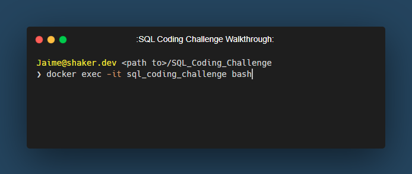
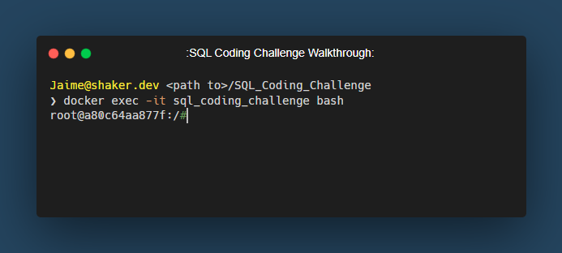
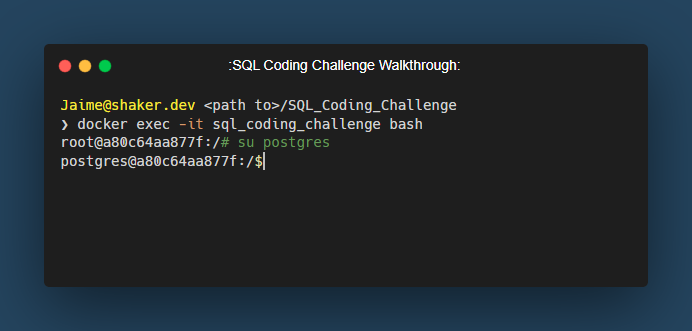
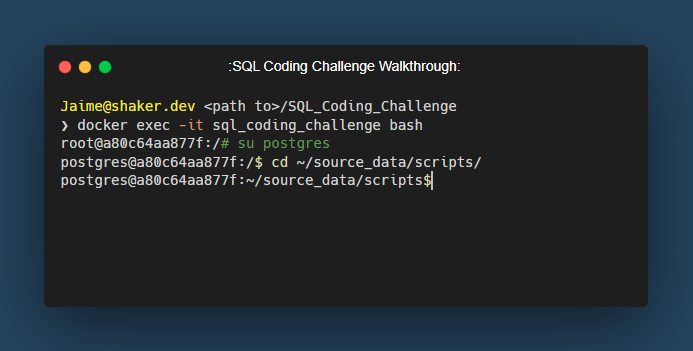
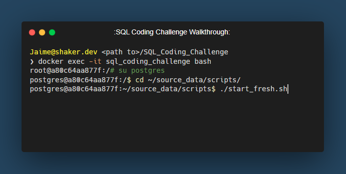
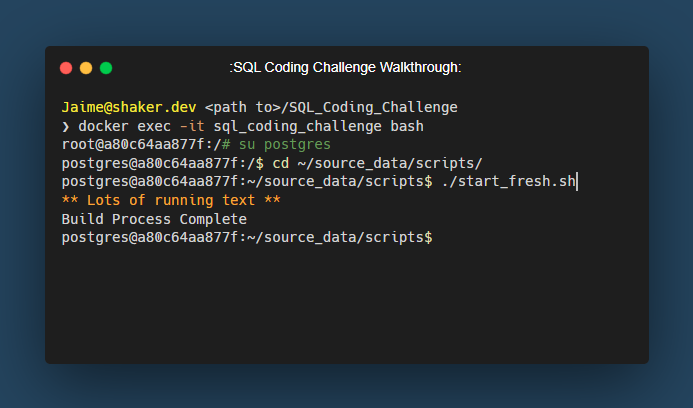

## Shaker's SQL Code Challenge

**Author**: Jaime M. Shaker <br />
**Email**: jaime.m.shaker@gmail.com <br />
**Website**: https://www.shaker.dev <br />
**LinkedIn**: https://www.linkedin.com/in/jaime-shaker/  <br />

:exclamation: If you find this repository helpful, please consider giving it a :star:. Thanks! :exclamation:

### Bash Script

What is Bash?  
* The name stands for **B**ourne **A**gain **SH**ell. It is an open source version of the Bourne Shell and was first released in 1989.

What is a Bash script?
* A Bash script is a plain text file which contains a series of commands. These are the commands we would normally type ouselves on the command line.  Using [psql](https://www.postgresguide.com/utilities/psql/), we can create a Bash script that will execute our `.sql` files in order and always start with a fresh, clean database everytime we run the script.

Do I have Bash on my computer?
* If you are following along this walk-through and using the Docker container, the answer is YES!  Bash is also the default shell used in Linux and MacOS.

First, let's connect to our Docker/PostgreSQL container by opening up another command line terminal and type in this command.

`docker exec -ti sql_coding_challenge bash`

 

 After executing this command, you should be logged into the Docker container as `root`.  Keep in mind that the `@a80c64aa877f` portion is the actual Docker ID for this container, which will be different your your unique container.

 

 We are logged in as the `root` user.  Let's substitute the user with the `su` command.  In the terminal type and execute

 `su postgres`

 

 We are now connected to the container as the user `postgres`.  Now we can cd (change directory) to where our scripts are located.

 `cd ~/source_data/scripts/`

 We are now in our `source_data/scripts` directory.  
 
  
 
 Create a new file in the `source_data/scripts` directory and name it

 `start_fresh.sh`

 This is the Bash script that will execute the psql code.  Inside of the `start_fresh.sh`,  script should look like this.

 ```bash
 #!/bin/bash

echo "Drop All Tables"
psql sql_coding_challenge -f drop_all_tables.sql
echo "Executing build_tables.sql"
psql sql_coding_challenge -f build_tables.sql
echo "Executing normalize_tables.sql"
psql sql_coding_challenge -f normalize_tables.sql
echo "Executing remove_duplicates.sql"
psql sql_coding_challenge -f remove_duplicates.sql
echo "Executing cleanup_db.sql"
psql sql_coding_challenge -f cleanup_db.sql
echo "Executing create_relationships.sql"
psql sql_coding_challenge -f create_relationships.sql
echo "Build Process Complete"
 ```

To run this script, use the command in the same directory as the script location.

`./start_fresh.sh` or `bash start_fresh.sh`



Once the script starts, there will be a lot of text on the terminal and once it's complete, should look something similar to this.



We are now right back to where we were when we first started this page.  However, now we have a script that we can run our SQL scripts and have a fresh set-up all the time, everytime.

We are now ready to complete the `SQL Coding Challenge`.

click the link below

Go to [WALKTHROUGH_CODE_CHALLENGE](WALKTHROUGH_7_CODE_CHALLENGE.md)

:exclamation: If you find this repository helpful, please consider giving it a :star:. Thanks! :exclamation:


